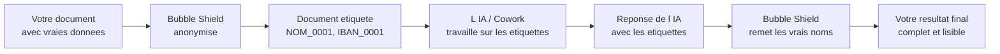
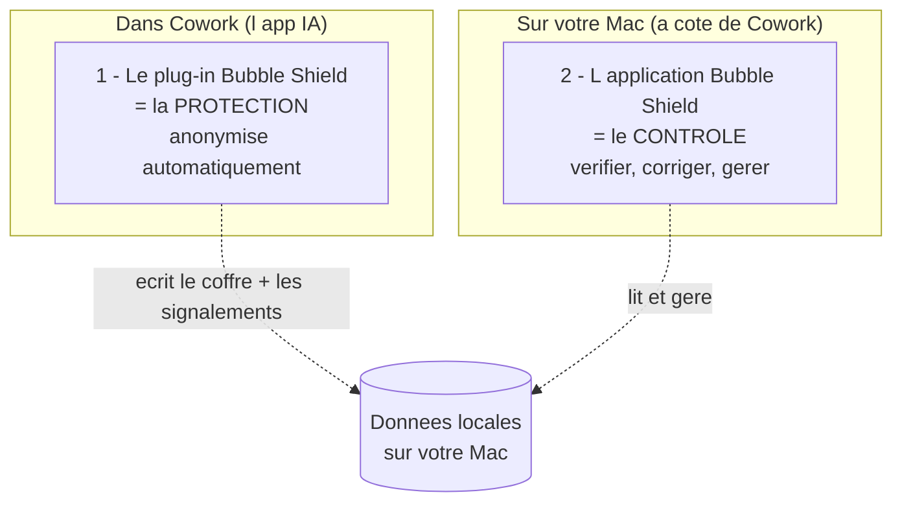
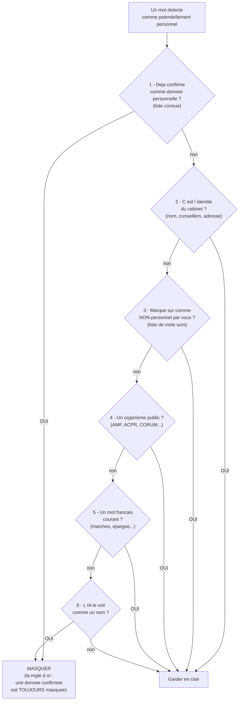
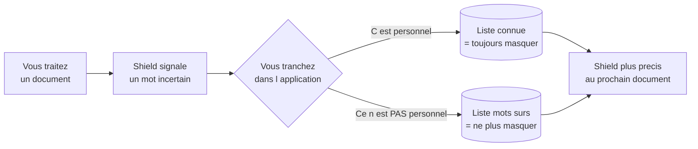
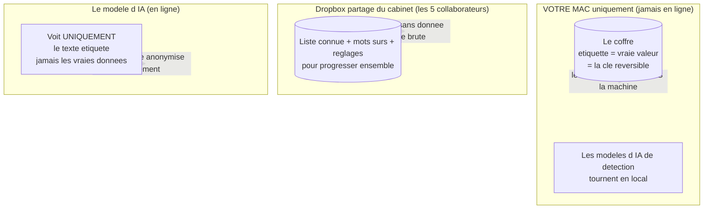
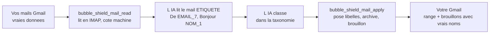

# Bubble Shield — Le produit en entier

### Comment c'est construit, comment ça protège vos données, et pourquoi vous pouvez lui faire confiance

*Document de référence. Détaillé, mais sans jargon. Si vous voulez juste démarrer, lisez plutôt le « Guide de démarrage ». Ici, on ouvre le capot.*

---

## 1. L'idée en une image

Quand vous demandez à une IA (Cowork / Claude) de travailler sur un dossier client, l'IA doit « lire » le document. Le problème : ce document contient des **données personnelles** — noms, IBAN, e-mails, numéros fiscaux. Vous ne voulez pas que ces données partent telles quelles vers un modèle d'IA.

**Bubble Shield se glisse entre vos documents et l'IA.** Avant que l'IA ne voie quoi que ce soit, Shield remplace chaque donnée identifiante par une **étiquette anonyme réversible** — `NOM_0001`, `IBAN_0001`. L'IA travaille sur la version étiquetée. À la fin, Shield **remet les vrais noms** dans la réponse, pour vous.

> **Le vestiaire de théâtre.** À l'entrée, chaque manteau (chaque donnée identifiante) reçoit un numéro. L'IA ne voit que les numéros. Le **registre** qui relie les numéros aux vrais noms reste dans un tiroir fermé, **sur votre ordinateur** — il ne part jamais ailleurs. À la sortie, on rend chaque manteau à son propriétaire grâce au registre.

Le point essentiel : **l'IA n'a jamais su de qui il s'agissait.** Et le registre (la « table de correspondance ») ne quitte jamais votre machine.

---

## 2. Le produit a deux parties

Bubble Shield, c'est **deux briques complémentaires** qui travaillent ensemble :

**1. Le plug-in (la protection).** Il vit *dans* Cowork. C'est lui qui fait le travail invisible : détecter les données personnelles et les remplacer par des étiquettes, automatiquement, à chaque fois que l'IA touche un dossier protégé. Vous ne le voyez pas travailler — c'est voulu.

**2. L'application (le contrôle).** C'est une petite application qui s'installe une fois sur votre Mac. Elle vous donne un **tableau de bord** : vérifier ce qui a été anonymisé, corriger une erreur, gérer la liste des noms connus. Le plug-in protège ; l'application vous laisse **superviser**.

> **Pourquoi deux parties et pas une seule ?** Pour votre sécurité. Cowork fonctionne dans un « bac à sable » isolé — c'est ce qui empêche l'IA d'aller fouiller partout sur votre ordinateur. Mais ce même isolement empêche le plug-in d'ouvrir une fenêtre de contrôle directement. L'application de contrôle doit donc vivre *à côté*, sur votre Mac, avec accès aux données locales. Ce n'est pas un défaut : c'est la barrière de sécurité qui fait son travail.

---

## 3. Comment Shield décide quoi masquer (le cœur du système)

C'est la partie la plus importante à comprendre. Shield ne se contente pas d'un seul outil de détection — il **empile plusieurs couches**, et il a une règle d'or qui prime sur tout.

### Les détecteurs

- **Les formats sûrs (regex).** Un IBAN, un numéro de Sécurité sociale, un SIREN ont une forme précise et vérifiable. Shield les attrape de façon déterministe, sans se tromper.
- **L'intelligence artificielle de détection (NER).** Pour les noms de personnes — qui n'ont pas de « forme » fixe — Shield utilise un modèle d'IA local (GLiNER, renforcé par un second modèle). Il tourne **sur votre Mac**, rien ne part en ligne.

### Le problème du sur-masquage, et comment on le règle

Un détecteur de noms par IA, réglé pour **ne jamais rater un vrai nom**, a tendance à être trop zélé : il peut prendre « CORUM » (un fonds), « AMF » (le régulateur) ou même « marchés » (un mot courant) pour des noms de personnes. Résultat : un document criblé d'étiquettes inutiles.

Shield corrige ça avec une **chaîne de priorité**. Chaque mot détecté passe par ces filtres, **dans cet ordre** :

**La règle d'or, en haut de la chaîne :** si une donnée a été **confirmée comme personnelle** (elle est dans la « liste connue »), elle est **toujours masquée** — même si par ailleurs elle ressemble à un mot courant. La protection prime toujours sur la commodité. En cas de doute, Shield masque. **Jamais l'inverse.**

---

## 4. Le système qui apprend (la « liste connue »)

Plus vous utilisez Shield, plus il devient précis — automatiquement.

- **Quand vous confirmez** qu'un mot signalé est bien une donnée personnelle, il entre dans la **liste connue** (le « gazetteer »). Désormais, ce nom sera masqué partout, à tous les coups, même si l'IA l'aurait raté.
- **Quand vous indiquez** qu'un mot a été masqué à tort (par ex. « marchés »), il entre dans la **liste des mots sûrs**. Il ne sera plus jamais masqué inutilement.

C'est un cercle vertueux : chaque décision que vous prenez rend l'outil meilleur, **sans réglage technique**.

---

## 5. L'application de contrôle (sur votre Mac)

Vous l'ouvrez quand vous voulez vérifier ou ajuster. Trois écrans principaux :

| Écran | À quoi ça sert |
|---|---|
| **File de révision** | La « boîte de réception » des mots incertains que Shield a signalés. Pour chacun : **Confirmer** (c'est personnel → liste connue) ou **Ignorer** (ce n'est pas personnel → liste des mots sûrs). |
| **Coffre** | La table de correspondance d'un dossier : quelle étiquette = quelle vraie donnée. Les valeurs sont **masquées par défaut** ; vous cliquez sur 👁 pour révéler une valeur précise. Vous pouvez **corriger** une valeur (ex. une faute de scan) ou **oublier** une personne (droit à l'effacement RGPD). |
| **Liste connue** | Voir et retirer une entrée de la liste des données confirmées. La soupape de sécurité si quelque chose a été confirmé par erreur. |

> **Sécurité de l'application :** les vraies valeurs ne s'affichent jamais d'elles-mêmes — il faut cliquer pour révéler, et chaque révélation est tracée. Les opérations destructrices (oublier un jeton) demandent une confirmation tapée. Tout reste en local sur votre Mac.

---

## 6. Où vivent les données (la carte de confiance)

C'est la question qui compte pour le RGPD. Voici **exactement** où va chaque chose :

- **Le coffre** (étiquette ↔ vraie valeur) — **strictement local, par machine, jamais partagé, jamais en ligne.** C'est la seule chose qui peut « dé-anonymiser ». La partager serait recréer exactement la fuite que le produit empêche. Donc : jamais.
- **La liste connue + mots sûrs + réglages** — *peuvent* être partagés dans un dossier Dropbox du cabinet, pour que les 5 collaborateurs progressent ensemble. C'est sans risque car ces listes améliorent la détection sans contenir le lien réversible vers les dossiers.
- **Le modèle d'IA en ligne** — ne reçoit **que** le texte anonymisé. Au sens du RGPD, c'est une **pseudonymisation réversible** (mesure de sécurité, art. 32) : le coffre restant local, le texte transmis peut être considéré anonyme côté destinataire.

> Aide à la décision, pas un avis juridique. La revue humaine reste requise — c'est précisément le rôle de l'application de contrôle.

---

## 7. La garantie « fail-closed » (le filet de sécurité)

Le principe le plus important : **Shield échoue toujours du côté sûr.**

- Tant qu'une donnée identifiante **subsiste** dans un document, Shield **refuse de le déclarer « sûr à envoyer ».** Il ne vous laissera pas envoyer par erreur un document mal nettoyé.
- Si le détecteur d'IA est indisponible, Shield **refuse plutôt que de laisser passer** — il ne fait jamais semblant d'avoir vérifié.
- Si un fichier de configuration est corrompu, Shield **masque plus, pas moins.**
- Le coffre est écrit de façon **atomique** : une coupure en plein enregistrement ne peut pas le corrompre.

En clair : si quelque chose tourne mal, le pire cas est « trop prudent », jamais « une fuite ».

---

## 8. Le tri de la boîte mail (même principe, appliqué aux e-mails)

Le même moteur qui protège vos dossiers sert aussi à **trier votre boîte Gmail** — plusieurs fois par jour, ou en une passe le matin — **sans que l'IA voie jamais un vrai nom, une vraie adresse ou un vrai objet nominatif**. Shield lit chaque mail *déjà étiqueté*, décide où le classer, applique les libellés et archive, et peut préparer un **brouillon** de réponse. Rien n'est jamais envoyé, rien n'est jamais supprimé.

### Le flux : lire → juger → appliquer (tout côté machine)

Deux outils, jamais le connecteur Gmail natif :

| Étape | Outil | Ce que l'IA voit |
|---|---|---|
| **Lire** un mail | `bubble_shield_mail_read` | le corps **étiqueté** : `Bonjour NOM_1, …` + une ligne `UID:` (un simple numéro de boîte, pas une donnée personnelle) |
| **Appliquer** (libellé / archive / brouillon) | `bubble_shield_mail_apply` | **rien du corps** — seulement un résumé succès/échec |

Le mail brut ne touche **jamais** le contexte du modèle. Et quand l'IA rédige un brouillon avec les étiquettes (`Bonjour NOM_1`), c'est `bubble_shield_mail_apply` qui **restaure les vrais noms directement dans le brouillon Gmail** via le coffre — le vrai nom finit dans Gmail, jamais sous les yeux du modèle ni sur le disque.

### Pourquoi côté machine (IMAP), et pas via le connecteur Gmail

C'est le point d'architecture clé. Dans une tâche planifiée non surveillée, **Cowork grise ses propres outils de mutation Gmail** (il ne laisse pas une IA modifier une boîte sans validation humaine) — et un connecteur Gmail natif renverrait de toute façon le mail **en clair** au modèle. Les deux outils de Shield tournent donc **côté machine, en IMAP** : c'est précisément ce qui permet au tri de s'exécuter **le matin, tout seul, sans aucune validation à demander** — Shield lit, juge, applique, et poste un compte-rendu.

### La liste clients : le rattachement jeton-à-jeton (la dépendance clé)

Ce qui rend le tri à la fois **précis et générique**, c'est que le cabinet dépose sa liste de vrais clients dans le **dossier protégé** (`clients/clients_routing.csv`) et que Shield la matche contre les mails **sans jamais voir un vrai email** :

1. La liste est lue **étiquetée** comme n'importe quel fichier protégé : `EMAIL_7,GUILLAUME`, `EMAIL_12,TRANSITION`…
2. Grâce au **coffre partagé**, l'email d'un client porte **le même jeton** dans la liste ET dans le mail (`De: EMAIL_7`). Le rattachement se fait donc **jeton-à-jeton** — jamais sur de vrais emails.
3. **Auto-actualisation :** le cabinet ré-exporte sa liste O2S (ou tout CRM) quand il veut ; comme la liste est relue à chaque passage, le tri se met à jour **sans toucher au code, sans redéploiement**.

### Les garanties de sécurité (structurelles, pas déclaratives)

- 🚫 **Jamais d'envoi.** `bubble_shield_mail_apply` ne sait techniquement pas envoyer — **aucun SMTP**, uniquement l'ajout au dossier des brouillons. Un humain envoie.
- 🗑 **Jamais de suppression.** Aucun chemin `\Deleted`/corbeille/spam. « Archiver » = retirer `\Inbox` seulement, et c'est **réversible** (`unarchive` le remet en boîte). Le pire cas d'une erreur = un mail mal étiqueté ou archivé, **toujours récupérable** dans « Tous les messages ».
- 🔒 **Fail-closed.** Si le détecteur NER est indisponible, `bubble_shield_mail_read` **refuse** plutôt que renvoyer du brut — le tri se suspend jusqu'à son retour, il ne bascule jamais sur une lecture en clair.
- 📋 **Plafonné et journalisé.** Le nombre de mutations par passage est plafonné, chaque action est loggée (chmod 600, sans les noms de libellés custom potentiellement personnels). Un brouillon dont un jeton resterait non résolu est **sauté**, jamais envoyé avec des marqueurs visibles.

### Corriger un tri

Un classement n'est jamais figé. Si vous signalez une erreur — « ce n'est pas un client, c'est une newsletter », « remets-le en boîte » — l'IA corrige avec les **mêmes** décisions : `remove_labels` (retire un libellé posé à tort), un changement de catégorie (retire l'ancien libellé + ajoute le bon en une décision), ou `unarchive` (remet en boîte). Retirer un libellé ne fait que **dé-tagger** — ça ne supprime **jamais** le message.

---

## 9. Ce qu'il faut retenir

1. **Vous déposez vos dossiers dans un dossier protégé.** Shield fait le reste, automatiquement.
2. **L'IA ne voit que des étiquettes.** Les vrais noms restent sur votre Mac, dans le coffre.
3. **Vous récupérez un document complet** avec les vraies données.
4. **L'application de contrôle** vous laisse vérifier, corriger, et apprendre à l'outil ce qui est personnel ou non.
5. **En cas de doute, Shield masque.** La protection prime toujours.

---

*Pour démarrer concrètement, voir le « Guide de démarrage » (Bubble-Shield-tutoriel-client-FR). Pour le détail RGPD, voir COMPLIANCE_RGPD.*
