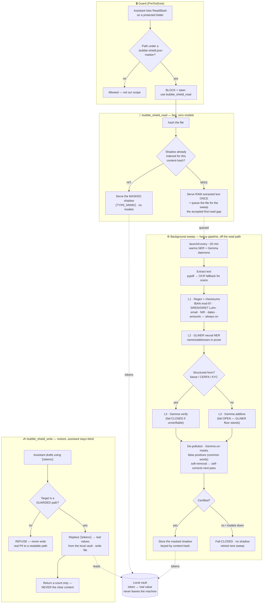

<div align="center">

#  Bubble Shield 

**Local, reversible PII pseudonymisation for LLM workflows.**

Put your sensitive data in the vault before you talk to a model — pseudonymise on
the way *in*, restore the answer on the way *out*, and the real values
never leave the machine. (Reversible pseudonymisation, a GDPR art. 32 security
measure — not irreversible "anonymisation" in the RGPD sense; the vault keeps it
reversible and stays local.)

</div>

---

Bubble Shield replaces identifying data (names, IBANs, e-mails, tax IDs, amounts…)
with **reversible tokens** like `NOM_0001`, shows you a before/after diff, and
**refuses to certify a document as safe-to-send while any PII still survives**
(fail-closed). The mapping between tokens and real values lives in a local
*vault* that is never part of what you send to an LLM.

It specialises in **French / finance** documents (the entity set and the demo
are FR-first) but the engine is generic and the entity list is easy to extend.

> Built deliberately *on top of* existing prior art (Presidio, PII-Shield,
> DontFeedTheAI, anonLLM) rather than reinventing it — see
> **[PRIOR_ART.md](PRIOR_ART.md)** for exactly what is borrowed and where Bubble Shield
> diverges.

## Why it's safe by design

- **100 % local.** The core is pure-stdlib Python — no network, no API calls,
  no telemetry. The demo webapp binds `127.0.0.1`.
- **Reversible without a parallel database.** Opaque math-bracket sentinels
  `TYPE_NNNN` survive copy/paste and LLM reformatting, and restore by exact
  replace. The vault is the only place real values live once a doc is cloaked.
- **Fail-closed.** Bubble Shield re-scans its own output; if a PII-shaped string
  survives, or a detection landed below the confidence threshold, the document
  is flagged **unsafe to send**. A missed PII is the real risk, so recall is
  what the bench optimises.
- **Layered, optional ML.** A zero-dependency regex + checksum core (IBAN
  mod-97, ISIN/SIREN Luhn) that runs anywhere, plus two **optional** layers that
  *only ever add recall* and fail open to the core when their backend is absent.
- **Encryption at rest (art. 32).** The vault concentrates all the mission's PII,
  so it is the highest-value file on the machine. `Vault.save_encrypted()` /
  `load_encrypted()` give authenticated, pure-stdlib encryption (PBKDF2 + HMAC-CTR,
  encrypt-then-MAC — no `pip install`). The default `save()` still writes chmod-600
  cleartext, so it now **warns loudly** when it does, and a one-command migration
  encrypts existing vaults in place:
  `python3 -m bubble_shield.vault encrypt <vault-dir>` (`status` to audit first).
  *Encrypt-by-default with machine-local key management is the tracked follow-up.*

## How it works — the pipeline

Three flows: the **guard** stops a raw read, **read** serves a masked copy fast,
and a background **sweep** does the heavy anonymisation off the read path. A
separate **restore** flow writes a finished document with the real values back —
without the assistant ever seeing them.



**Reading the chart**

- **Guard → read:** a raw `Read` of a protected file is blocked; the assistant
  must go through `bubble_shield_read`, which serves a pre-masked shadow with
  **zero models** on a cache hit. Only a brand-new file's *first* read returns raw
  (then it's queued) — the documented, accepted gap.
- **Sweep:** the expensive work (extract → OCR → GLiNER → Gemma → de-pollution)
  runs in the background where latency doesn't matter, and **fail-closes** a
  document it can't certify (no shadow stored — it retries next sweep).
- **De-pollution self-corrects:** un-masking a false positive is a *soft removal*
  (no permanent allowlist), so if the judge was wrong the value is re-detected and
  re-masked on a later pass — no human in the loop for the routine case.
- **Restore:** `bubble_shield_write` refuses any non-guarded target, so a restored
  real document can only land where a later `Read` is itself blocked — the assistant
  never sees the clear values.

## Detection layers

| # | Layer | Backend | Default | Covers |
|---|-------|---------|---------|--------|
| 1 | Regex + checksums | pure stdlib | **on** | IBAN, ISIN, SIRET/SIREN, e-mail, NIR/sécu, n° fiscal, FR phone, amounts, dates, titled names |
| 2 | Neural NER | GLiNER (ONNX), on-device daemon | opt-in (accuracy pack) | person names, orgs, locations the regex misses |
| 3 | LLM judge | Gemma (MLX), on-device daemon | opt-in (accuracy pack) | de-pollution + a 2nd-pass masker for degraded/scanned forms |

Layer 1 (regex + checksums) runs everywhere with zero dependencies. Layers 2–3
are the **accuracy pack** — two small on-device models (GLiNER for neural name
detection, Gemma for the de-pollution judge and the degraded-form second pass),
installed with one command (`bubble_shield_setup_ml`) and run as local daemons
on `127.0.0.1` (no network egress). They are **off until the pack is installed**,
and always *fail open to the regex core*: if a model or its daemon is absent, the
regex layer still runs — the accuracy pack only ever **adds** recall, never
removes the baseline. (Two older optional layers — Presidio/spaCy NER and an
Ollama LLM — remain in the codebase as dormant fallbacks but are not the shipped
detection stack.)

## Gazetteer de-pollution

The cross-session name gazetteer (the deny-list that lets Bubble Shield keep
masking a name it has seen before, even outside the document it first appeared
in) is deliberately biased toward over-collection: anything that even looks
like a proper noun gets added, because a missed real name is the risk that
matters. Over time this means the gazetteer accumulates **false positives** —
form-label words and common nouns that happened to be capitalised in a source
document and got swept in alongside real names.

De-pollution is a background pass that removes exactly those false positives
from the gazetteer — **without ever touching masking recall.** It changes
nothing about what gets detected or masked going forward; it only decides
whether an *already-flagged* gazetteer entry should keep being treated as a
name.

**How it decides, in two stages:**

1. **Frequency + structure triage (no model, instant).** A lowercase, high
   -frequency common word is judged safe to drop with pure statistics — no
   inference needed.
2. **On-device model adjudication (the ambiguous middle).** The remaining
   entries go to a small **local, on-device language model** running as a
   background daemon on `127.0.0.1` only (no network egress, nothing ever
   leaves the machine). Only three entity types are ever eligible — person
   names, job titles, and addresses; every other type (IBAN, SIRET,
   social-security number, email, phone, tax IDs, dates, company names, …) is
   **never adjudicated and never un-masked**, a structural guarantee that
   de-pollution cannot touch checksum-verified identifiers. For the eligible
   entries the model is asked one question per candidate — "is this a real
   identifying value (a person's name, a real address, a company) or a generic
   label / job title / boilerplate phrase?" — and only an *unambiguous*
   "generic" answer un-masks. A lone word that could be a surname (even one
   that is also a common word, like *Petit*) is kept masked. Anything unclear,
   any model error, a batch that times out, or the daemon simply being
   unavailable all resolve the same way: **the entry stays masked.** This is a
   fail-toward-masking design end to end — de-pollution can only ever make
   masking *more readable*, never less protective. Requests to the daemon are
   chunked so a large background pass never stalls the single on-device worker.

**Self-correcting, with a human backstop.** An entry that's removed from the
gazetteer isn't blocked from re-entering it — if the same value shows up
again as a plausible name later, ordinary detection re-adds it, so a
misclassification is never permanent. Every de-pollution decision is also
logged to a review queue for human audit, and a human can mark an entry
**sticky** — a manual override that de-pollution will not touch, for the rare
case where an automated decision needs to be pinned one way or the other by
a person instead of the model.

**Measured (real 742-entry gazetteer, on-device model, end-to-end through the
daemon).** One background pass un-masked ~78 false positives — job titles
("Consultant", "Cadre supérieur"), form labels ("déclarant 2", "Nom de
naissance"), and boilerplate phrases ("cadre de notre activité de Conseil") —
while un-masking **0** structured identifiers, **0** real person names (including
bare single-token surnames that are also common words), and only **1** of 110
real addresses (a truncated address with a form-label tail, caught in the review
queue). Overall masking recall is unchanged (98.9% overall, 97.1% on names).
De-pollution runs continuously, so the gazetteer converges toward clean over
successive passes.

**Net effect:** the gazetteer stays sensitive to real names (recall
unchanged) while shedding the noise that made masked output harder to read.
De-pollution is a readability improvement layered *on top of* the existing
fail-closed detection guarantee, not a replacement for it.

## Shadow-index runtime — why reads are fast

Running the PII models (GLiNER, Gemma, OCR) on every read made opening a
protected file slow. Since v1.23.0 the heavy work is moved **off the read path
into a background sweep**, so a read touches **zero AI models**.

**Two moving parts:**

1. **The background sweep** walks the protected folder, and for each file runs
   the full anonymisation engine once, storing the masked result in a local
   **shadow store** keyed by the file's content hash. This is where GLiNER +
   Gemma + OCR actually run. It happens in the background (a scheduled/idle
   sweep, and any read of a not-yet-indexed file queues that file for the next
   pass). The on-device models are **lazy** — they load only when the sweep
   needs them and free ~10 min after, so an idle machine holds ~0 GB.

2. **The read** (`bubble_shield_read`) is a **hash → serve** lookup with no
   models:
   - **Hit** (file already in the shadow store) → returns the pre-computed
     masked copy instantly. A cheap exact-string safety net additionally masks
     any gazetteer-confirmed name that leaked into that shadow.
   - **Miss** (brand-new or just-changed file the sweep hasn't reached) → serves
     the **raw extracted text this one time** and queues the file, by explicit
     product decision (speed over read-time masking). Full masking lands on the
     next sweep. So the **first** read of a fresh document can contain PII in
     clear until the sweep catches up — for guaranteed masking on a new dossier,
     let the sweep index it first, or use the whole-folder batch flow.

The shadow store is local and content-hash keyed, so renaming a file doesn't
lose its shadow, and an edited file is re-indexed automatically (its hash
changes → miss → re-sweep).

## Quickstart

```bash
git clone <this-repo> bubble_shield && cd bubble_shield
python -m venv venv && source venv/bin/activate
pip install -r requirements.txt          # demo webapp deps; the engine needs none

# 1) Try the demo webapp (binds 127.0.0.1 only — own-machine / screen-share tool):
uvicorn webapp.app:app --host 127.0.0.1 --port 8765
#    → open http://127.0.0.1:8765
#
#    Demo flow: paste text → see PII cloaked with tokens, before/after side-by-side,
#    vault table (token↔value, local only), then toggle masquer/conserver per entity
#    type and re-anonymise to see the policy take effect.
#
#    What the "Contrôle & réglages" dashboard exposes:
#      • Risk stats — runs / unsafe / errors / safe-rate across all sessions.
#      • Policy table — masquer/conserver toggle for ALL entity types, including
#        any custom fields you've added via MCP (uses extended_policy_view()).
#      • Champs personnalisés — list current regex/GLiNER/keep-list entries and add
#        new ones; every add is validated by pii_guard.check_input() (same guard as MCP,
#        single source of truth — a real IBAN or proper noun is refused identically).
#      • Détecteur — select gliner / openai / both; the OpenAI mode badge shows its
#        true availability (requires onnxruntime < 1.27) so the UI is never dishonest.
#
#    pypdf is resolved automatically: system install first, then the vendored copy at
#    plugin/bubble-shield/vendor/pypdf — so PDF upload works without extra pip installs.
#    Scanned/image PDFs are not supported (no OCR); the page shows a clear notice.
#
#    NOTE: this webapp is an own-machine dev/demo tool only. It binds 127.0.0.1 and
#    is NOT part of the shipped plugin payload (not vendored into plugin/).

# 2) Run the reliability bench (recall/precision on FR finance fixtures):
python bench/run_bench.py

# 3) Tests:
pytest
```

### Use it as a library

```python
from bubble_shield import AnonymizationEngine, Vault

engine = AnonymizationEngine(vault=Vault(mission="dossier-dupont-2026"))
res = engine.anonymize("Monsieur Jean Dupont, IBAN FR76 3000 6000 0112 3456 7890 189.")

res.anonymized      # 'Monsieur NOM_0001, IBAN IBAN_0002.'
res.safe_to_send    # True  (entities found & masked, no residual, no sub-threshold)
res.verdict_state   # 'masked_ok' | 'leak' | 'low_confidence' | 'zero_detection' | 'nothing_to_do'
res.verdict_fr      # human-facing FR verdict for the state above
engine.deanonymize(res.anonymized)   # round-trips back to the original

# NB: a SUBSTANTIAL document where the engine finds ZERO entities is NOT reported
# as safe — res.safe_to_send is False and verdict_state == 'zero_detection'.
# "Found nothing" is not "safe"; on free text it often means a name was MISSED.
```

## Turning on the neural layers (the accuracy pack)

The neural layers are the **accuracy pack** — GLiNER (ONNX name detection) and
Gemma (MLX de-pollution judge + degraded-form masker), plus the OCR reader.
They're installed with one command and run as on-device daemons (no network
egress). Install/check them all in one pass:

```bash
# From the plugin (or via the bubble_shield_setup_ml MCP tool during onboarding):
python3 plugin/bubble-shield/scripts/bubble_shield_setup_ml.py
# One-time ~5-6 GB download (Gemma is the largest). Models already on disk are
# skipped. Everything stays local; nothing leaves the machine.
```

They **fail open to the regex core**: if a model or its daemon is absent, the
regex layer still runs — the pack only ever *adds* recall, never removes the
baseline.

> Two older optional layers — a Presidio/spaCy NER path (`use_ner=True`) and an
> Ollama LLM path (`use_llm=True`) — remain in the engine as dormant fallbacks,
> but they are NOT the shipped detection stack (which is GLiNER + Gemma). You can
> also plug in any custom detector:

```python
AnonymizationEngine(extra_detectors=[my_gazetteer])   # any text -> list[Match]
```

## Layout

```
bubble_shield/
├── bubble_shield/
│   ├── engine.py        # detect → anonymise / de-anonymise + fail-closed scan
│   ├── recognizers.py   # FR/finance regex + checksum recognizers
│   ├── vault.py         # the reversible token ↔ value store (per mission)
│   ├── gazetteer.py     # French first-name list (untitled-name recall)
│   ├── presidio_ext.py  # optional Presidio/spaCy NER layer
│   └── llm_ext.py       # optional local-LLM (Ollama) prose layer
├── webapp/              # FastAPI + Jinja demo (before/after, vault, verdict)
├── bench/               # reliability bench + FR finance fixtures
├── tests/               # 38 tests
└── PRIOR_ART.md         # what Bubble Shield borrows and where it diverges
```

## Status

Reliable anonymiser + demo webapp + reliability bench (100 % recall on the
fixture set). The next building block — wiring Bubble Shield into an LLM client
(Claude Code hooks / a proxy) so anonymisation happens transparently — is a
separate, downstream concern and intentionally out of scope here.

## License

MIT — see [LICENSE](LICENSE).
